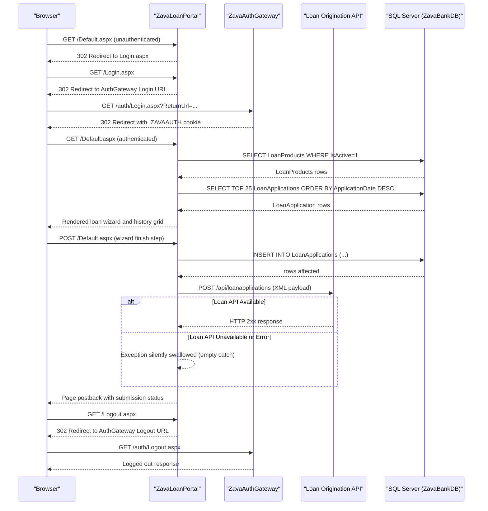

# API & Service Communication Contracts

ZavaLoanPortal exposes no REST API endpoints of its own — it is a server-rendered Web Forms application that communicates outbound with two external HTTP services: a ZavaAuthGateway for authentication and a Loan Origination REST API for downstream loan processing.

## Service Catalog

| Service | Port | Category | Purpose |
|---------|------|----------|---------|
| ZavaLoanPortal | 80 (IIS) | Business | ASP.NET Web Forms application serving the loan application wizard and loan history |
| ZavaAuthGateway | Configurable (default localhost:80) | Infrastructure | External authentication service handling login/logout via HTTP redirect flow |
| Loan Origination API | 8080 | Business | Downstream REST API receiving XML loan application payloads for origination processing |
| SQL Server (ZavaBankDB) | 1433 | Infrastructure | Relational database storing loan products and loan application records |

## API Endpoints Inventory

ZavaLoanPortal does not define any REST or HTTP API endpoints. It is a Web Forms application served via IIS. All page interactions occur via standard HTTP GET/POST form submissions handled by the ASP.NET runtime.

| Page | Method | Path | Interaction Type | Notes |
|------|--------|------|-----------------|-------|
| Login.aspx | GET | /Login.aspx | Page request | Redirects to AuthGateway if unauthenticated |
| Logout.aspx | GET | /Logout.aspx | Page request | Signs out and redirects to AuthGateway |
| Default.aspx | GET | /Default.aspx | Page request | Loads loan wizard and history grid |
| Default.aspx | POST | /Default.aspx | Form postback | Wizard step navigation and loan submission |

> Note: These are Web Forms page lifecycle events, not REST API endpoints. No `[ApiController]`, `[Route]`, or attribute-based routing exists in the project.

## Management & Observability Endpoints

| Service | Endpoint | Custom Metrics |
|---------|----------|---------------|
| ZavaLoanPortal | None configured | None |
| ZavaLoanPortal | No /health or /healthz endpoint | None |
| ZavaLoanPortal | No Swagger / OpenAPI UI | None |

No health check endpoints, metrics endpoints, or observability instrumentation (Application Insights, OpenTelemetry) are present in the application.

## DTOs & Contracts

The application does not define formal DTO or contract classes. Data flows between the UI and the database via raw `DataTable` objects populated through ADO.NET `SqlDataAdapter`. The only structured payload is the XML string hand-built inline in `Default.aspx.cs` for the Loan Origination API call:

```xml
<loanApplication>
  <customerId>{int}</customerId>
  <loanProductId>{int}</loanProductId>
  <requestedAmount>{decimal}</requestedAmount>
  <termMonths>{int}</termMonths>
</loanApplication>
```

This XML is not typed — it is constructed via string concatenation without a formal schema or serialization contract. No OpenAPI/Swagger specification, protobuf schema, or GraphQL schema is present. No JSON serialization libraries (System.Text.Json, Newtonsoft.Json) are used.

## Communication Patterns

**Synchronous Communication:**
- **Loan Origination API**: Outbound `HttpWebRequest` (synchronous, blocking) HTTP POST with `Content-Type: application/xml` to the configured `LoanOriginationApiUrl`. The call is fire-and-forget wrapped in a `try/catch` — no response is processed, errors are silently swallowed.
- **SQL Server**: Synchronous ADO.NET calls (`SqlConnection.Open()`, `SqlCommand.ExecuteNonQuery()`) with no connection pooling configuration beyond the default.
- **AuthGateway**: HTTP redirect-based (302 response) — no outbound HTTP call is made; the browser is redirected to the gateway URL.

**Asynchronous Communication:**
- None. All I/O is synchronous and blocking on the request thread.

**Resilience Patterns:**
- No circuit breaker, retry policy, or timeout configuration is implemented. The `SubmitApi` method wraps the `HttpWebRequest` in a bare `try/catch {}` (empty catch block) — all HTTP errors are silently suppressed. No Polly or similar resilience library is used.

**Service Discovery:**
- All service URLs are hardcoded in `web.config` via `<appSettings>` and `<connectionStrings>`. There is no service registry, DNS-based discovery, or environment-aware configuration mechanism.

**Security Posture:**
- **Authentication**: ASP.NET Forms Authentication with a persistent cookie (`.ZAVAAUTH`). Login is delegated to ZavaAuthGateway via redirect.
- **Authorization**: `<deny users="?" />` is applied globally; all pages require authentication except `Login.aspx` and `Logout.aspx`.
- **Transport Security**: No HTTPS/TLS is configured in `web.config`. All communication (browser to app, app to Loan API, app to SQL Server) runs over plain HTTP/TCP. The `machineKey` for Forms Authentication is hardcoded in `web.config` with static values, which is a security risk.
- **No API-level authentication**: The outbound call to the Loan Origination API uses no authentication headers — the request is unauthenticated.

## Service Technology Matrix

| Service | Web Framework | Data Access | Discovery | Gateway | Health Check | Cache | Metrics |
|---------|--------------|-------------|-----------|---------|-------------|-------|---------|
| ZavaLoanPortal | ASP.NET Web Forms 4.8 | ADO.NET (SqlClient) | None (hardcoded URLs) | None | None | None | None |
| ZavaAuthGateway | Unknown (external) | Unknown | N/A | N/A | N/A | N/A | N/A |
| Loan Origination API | Unknown (external) | Unknown | N/A | N/A | N/A | N/A | N/A |

## Service Communication Sequence


