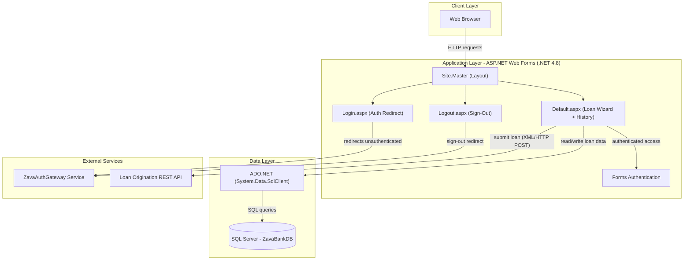
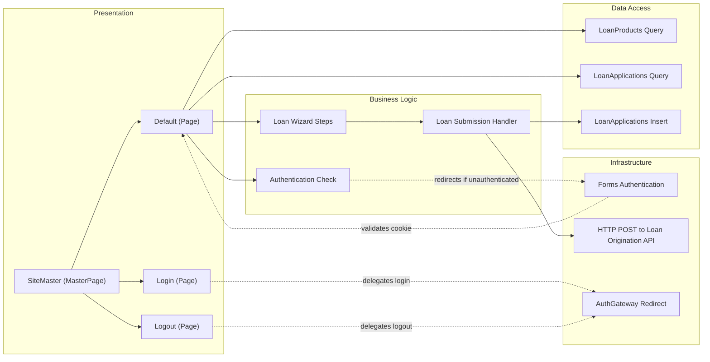

# Architecture Diagram

ZavaLoanPortal is a .NET Framework 4.8 ASP.NET Web Forms application that provides a loan application portal with Forms Authentication, direct SQL Server data access via ADO.NET, and integration with external authentication and loan origination services.

## Application Architecture

### Technology Stack Summary

| Layer | Technology | Version | Purpose |
|-------|-----------|---------|---------|
| Presentation | ASP.NET Web Forms | .NET 4.8 | Server-side web UI with code-behind pages |
| Presentation | Site.Master | N/A | Shared page layout and navigation |
| Business Logic | Page Code-Behind (C#) | .NET 4.8 | Loan application wizard logic, authentication checks |
| Security | ASP.NET Forms Authentication | .NET 4.8 | Cookie-based user authentication |
| Data Access | ADO.NET (System.Data.SqlClient) | .NET 4.8 | Direct SQL queries to SQL Server |
| Data Storage | SQL Server | Unspecified | Stores loan applications and loan product catalog |
| External Integration | ZavaAuthGateway | HTTP redirect | External authentication service |
| External Integration | Loan Origination API | HTTP/XML REST | Downstream API for loan origination processing |
| Hosting | IIS / Docker | N/A | Web server hosting |

### Data Storage & External Services

The application uses a single SQL Server database (`ZavaBankDB`) accessed directly through ADO.NET with `SqlConnection` and `SqlCommand`. Two tables are accessed: `LoanProducts` (product catalog lookup) and `LoanApplications` (storing submitted applications). There is no ORM or caching layer. Two external HTTP services are integrated: `ZavaAuthGateway` handles authentication via redirect-based login/logout flows, and a `Loan Origination API` receives XML payloads over HTTP POST when a loan application is submitted.

### Key Architectural Decisions

- **Web Forms Wizard pattern**: The loan application uses `asp:Wizard` for a multi-step form flow managed entirely server-side in the Default page code-behind.
- **Direct ADO.NET data access**: All database interactions use raw `SqlConnection`/`SqlCommand` calls without an ORM or repository abstraction layer.
- **Redirect-based external authentication**: Login and logout delegate to an external Auth Gateway service via HTTP redirects rather than handling credentials locally.

## Component Relationships

### Component Inventory

| Component | Layer | Type | Responsibility |
|-----------|-------|------|---------------|
| SiteMaster | Presentation | MasterPage | Shared layout, navigation bar, user status display |
| Login | Presentation | Web Forms Page | Redirects unauthenticated users to external Auth Gateway |
| Logout | Presentation | Web Forms Page | Signs out user and redirects to Auth Gateway logout URL |
| Default | Presentation | Web Forms Page | Hosts the loan application wizard and loan history grid |
| Loan Wizard Steps | Business Logic | Code-Behind Logic | Multi-step wizard for collecting personal info, employment, and loan details |
| Authentication Check | Business Logic | Code-Behind Logic | Verifies request authentication on page load |
| Loan Submission Handler | Business Logic | Code-Behind Logic | Orchestrates DB insert and external API call on wizard finish |
| LoanProducts Query | Data Access | ADO.NET Query | Retrieves active loan product catalog for dropdown binding |
| LoanApplications Query | Data Access | ADO.NET Query | Fetches recent loan application history for the grid |
| LoanApplications Insert | Data Access | ADO.NET Command | Inserts a new loan application record into SQL Server |
| Forms Authentication | Infrastructure | ASP.NET Security | Manages authentication cookie lifecycle |
| HTTP POST (Loan API) | Infrastructure | HttpWebRequest | Posts XML loan application payload to Loan Origination API |
| AuthGateway Redirect | Infrastructure | HTTP Redirect | Delegates login/logout flows to external authentication service |
