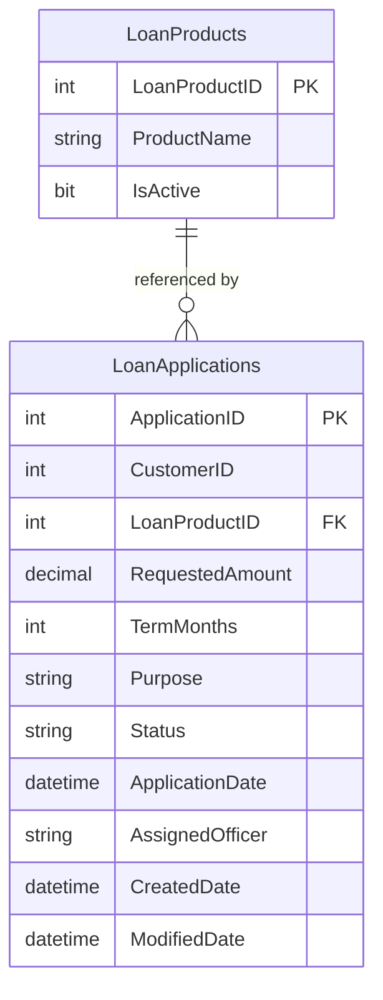

# Data Architecture & Persistence Layer

ZavaLoanPortal's data layer uses raw ADO.NET against a single SQL Server database (`ZavaBankDB`) with no ORM, no migration tooling, and no caching — all queries are hand-written SQL strings executed via `SqlConnection`/`SqlCommand`.

## Database Configuration

| Service/Module | DB Type | Profile | Driver | Connection | Migration Tool |
|---------------|---------|---------|--------|-----------|---------------|
| ZavaLoanPortal | SQL Server | All (single profile) | System.Data.SqlClient (.NET 4.8) | `Server=sqlserver,1433;Database=ZavaBankDB;TrustServerCertificate=true` | None |

No Flyway, Liquibase, or EF Migrations are configured. Schema is managed entirely outside the application. No seed data scripts or programmatic initialization are present. See `configuration-inventory.md` for the full property inventory.

## Data Ownership per Service

| Service | Tables Owned | ORM Framework | Caching | Notes |
|---------|-------------|--------------|---------|-------|
| ZavaLoanPortal | LoanApplications, LoanProducts | None (raw ADO.NET) | None | All SQL is inline string literals in code-behind; no stored procedures or views detected |

## Entity Model

> Note: No ORM entity classes exist. The table schema below is inferred from SQL statements in `Default.aspx.cs`.

## Key Repository Methods

There are no repository interfaces or data access classes. All data access is implemented inline in the `Default` page code-behind (`Default.aspx.cs`).

| Service | Method (inline) | Query | Purpose |
|---------|----------------|-------|---------|
| ZavaLoanPortal | `BindLoanProducts()` | `SELECT LoanProductID, ProductName FROM LoanProducts WHERE IsActive=1 ORDER BY ProductName` | Populates the loan product dropdown on page load |
| ZavaLoanPortal | `BindLoanHistory()` | `SELECT TOP 25 ApplicationID, CustomerID, RequestedAmount, TermMonths, Status, ApplicationDate FROM LoanApplications ORDER BY ApplicationDate DESC` | Populates the loan history GridView on page load and after submission |
| ZavaLoanPortal | `wizLoanApplication_FinishButtonClick` | `INSERT INTO LoanApplications (CustomerID, LoanProductID, RequestedAmount, TermMonths, Purpose, Status, ApplicationDate, AssignedOfficer, CreatedDate, ModifiedDate) VALUES (...)` | Inserts a new loan application record on wizard completion |

No stored procedures, views, transactions, or `TransactionScope` usage are present.

## Caching Strategy

No caching layer is configured. Every page load executes fresh database queries:

- `BindLoanProducts()` fetches all active loan products on every request (no cache)
- `BindLoanHistory()` fetches the last 25 loan applications on every request (no cache)

No `System.Web.Caching.Cache`, `MemoryCache`, `IDistributedCache`, Redis, or any HTTP output caching is used.

## Data Ownership Boundaries

The application uses a **shared single database** (`ZavaBankDB`) accessed only by ZavaLoanPortal. There are no other services with direct database access documented in this codebase; the Loan Origination API (external) receives data via HTTP POST and presumably maintains its own data store.

All data access originates from the single Web Forms application. There is no CQRS separation, no read replica, and no event sourcing. The `LoanApplications` table is both written and read by the same page code-behind (`Default.aspx.cs`), creating a tightly coupled read/write pattern with no abstraction boundary.

The `CustomerID` referenced in `LoanApplications` is an integer foreign key, but the `Customers` table is not present in this codebase — it is presumably owned by a separate system. Personal information collected during the loan wizard (first name, last name, email, employer, income) is **not persisted** to the database; only the `CustomerID` integer and loan product/amount details are stored.

### Data Classification & Sensitivity

| Entity | Sensitive Fields | Classification | Controls in Place |
|--------|----------------|---------------|------------------|
| LoanApplications | RequestedAmount, TermMonths, Purpose, AssignedOfficer | Financial / Internal | None — no encryption-at-rest, no field masking, no access controls at the data layer |
| LoanApplications | CustomerID | PII reference (FK to external customer record) | None — stored as plain integer; no access logging or masking |
| LoanProducts | None | Non-sensitive (product catalog) | N/A |

The database connection string in `web.config` includes `User Id=sa;****** — the SA (system administrator) account with a plaintext password. This is a high-severity credential exposure risk. No column-level encryption, transparent data encryption (TDE), or dynamic data masking is configured. Personal wizard fields (name, email, income) collected in the UI are not persisted but are present in HTTP POST bodies without explicit sanitization before display.
