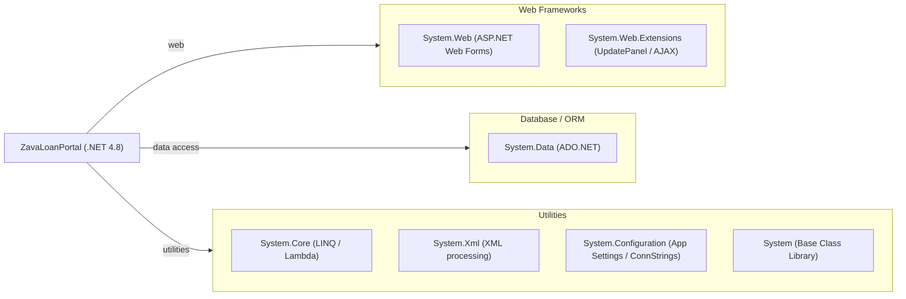

# Dependency Map

ZavaLoanPortal is a .NET Framework 4.8 ASP.NET Web Forms application. It declares **no external NuGet packages** — all dependencies are built-in .NET Framework assemblies referenced directly in the project file.

## Dependencies

### Dependency Summary

| Category | Count | Key Libraries | Notes |
|----------|-------|--------------|-------|
| Web Frameworks | 2 | System.Web, System.Web.Extensions | Legacy ASP.NET Web Forms on .NET Framework 4.8 — no upgrade path within .NET Framework |
| Database / ORM | 1 | System.Data (ADO.NET) | Raw SQL access via SqlConnection/SqlCommand; no ORM |
| Utilities | 4 | System.Core, System.Xml, System.Configuration, System | All BCL assemblies; no third-party utility libraries |

### Version & Compatibility Risks

All dependencies are built-in .NET Framework 4.8 assemblies. While .NET Framework 4.8 is in long-term support (security fixes only), it cannot run on .NET 8/10 without migration. `System.Web` — the core of ASP.NET Web Forms — is **not available in .NET Core/.NET 5+**, making it the primary migration blocker. `System.Data.SqlClient` can be replaced with the cross-platform `Microsoft.Data.SqlClient` NuGet package. `System.Web.Extensions` (providing `UpdatePanel` and AJAX functionality) has no direct equivalent in modern ASP.NET and would require a UI framework change (Blazor, Razor Pages, or MVC). The `System.Configuration` API has a compatible replacement in `Microsoft.Extensions.Configuration`.

### Notable Observations

- **No third-party NuGet packages**: The project relies exclusively on .NET Framework BCL assemblies — this simplifies dependency management but indicates a minimal feature set and heavy reliance on the framework's built-in capabilities.
- **System.Web is a hard migration blocker**: Web Forms and `System.Web` are not supported in .NET 6+ and must be replaced entirely when modernizing. Microsoft recommends migrating to Blazor Server, Razor Pages, or ASP.NET Core MVC.
- **Raw ADO.NET with System.Data.SqlClient**: The legacy `System.Data.SqlClient` namespace works on .NET Framework but should be replaced with `Microsoft.Data.SqlClient` for .NET 8+ compatibility. Introducing Entity Framework Core or Dapper would also reduce SQL injection risk.
- **System.Web.Extensions (UpdatePanel / AJAX)**: This assembly provides server-side partial-page rendering which has no equivalent in .NET Core. Any panels using `asp:UpdatePanel` will need to be rewritten using JavaScript, Blazor components, or a modern AJAX approach.

## Test Dependencies

No test-scope dependencies detected.

Total test-scope dependencies: 0

No testing framework or test projects were found in the repository. The solution contains no xUnit, NUnit, or MSTest references. Adding a test project with a modern testing framework (e.g., xUnit with Moq) is recommended before undertaking a migration.
