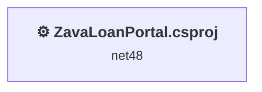
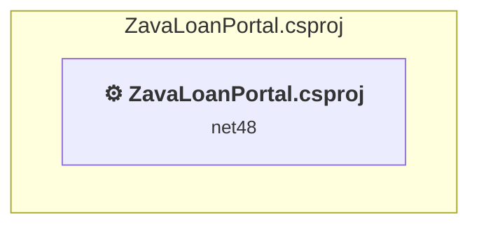

# Projects and dependencies analysis

This document provides a comprehensive overview of the projects and their dependencies in the context of upgrading to .NETCoreApp,Version=v10.0.

## Table of Contents

- [Executive Summary](#executive-Summary)
  - [Highlevel Metrics](#highlevel-metrics)
  - [Projects Compatibility](#projects-compatibility)
  - [Package Compatibility](#package-compatibility)
  - [API Compatibility](#api-compatibility)
  - [Binding Redirect Configuration](#binding-redirect-configuration)
- [Aggregate NuGet packages details](#aggregate-nuget-packages-details)
- [Top API Migration Challenges](#top-api-migration-challenges)
  - [Technologies and Features](#technologies-and-features)
  - [Most Frequent API Issues](#most-frequent-api-issues)
- [Projects Relationship Graph](#projects-relationship-graph)
- [Project Details](#project-details)

  - [ZavaLoanPortal.csproj](#zavaloanportalcsproj)

## Executive Summary

### Highlevel Metrics

| Metric | Count | Status |
| :--- | :---: | :--- |
| Total Projects | 1 | All require upgrade |
| Total NuGet Packages | 0 | All compatible |
| Total Code Files | 7 |  |
| Total Code Files with Incidents | 8 |  |
| Total Lines of Code | 7 |  |
| Total Number of Issues | 240 |  |
| Estimated LOC to modify | 238+ | at least 3400.0% of codebase |

### Projects Compatibility

| Project | Target Framework | Difficulty | Package Issues | API Issues | Binding Issues | Est. LOC Impact | Description |
| :--- | :---: | :---: | :---: | :---: | :---: | :---: | :--- |
| [ZavaLoanPortal.csproj](#zavaloanportalcsproj) | net48 | 🔴 High | 0 | 238 | 0 | 238+ | Wap, Sdk Style = False |

### Package Compatibility

| Status | Count | Percentage |
| :--- | :---: | :---: |
| ✅ Compatible | 0 | 0.0% |
| ⚠️ Incompatible | 0 | 0.0% |
| 🔄 Upgrade Recommended | 0 | 0.0% |
| ***Total NuGet Packages*** | ***0*** | ***100%*** |

### API Compatibility

| Category | Count | Impact |
| :--- | :---: | :--- |
| 🔴 Binary Incompatible | 131 | High - Require code changes |
| 🟡 Source Incompatible | 107 | Medium - Needs re-compilation and potential conflicting API error fixing |
| 🔵 Behavioral change | 0 | Low - Behavioral changes that may require testing at runtime |
| ✅ Compatible | 185 |  |
| ***Total APIs Analyzed*** | ***423*** |  |

## Aggregate NuGet packages details

| Package | Current Version | Suggested Version | Projects | Description |
| :--- | :---: | :---: | :--- | :--- |

## Top API Migration Challenges

### Technologies and Features

| Technology | Issues | Percentage | Migration Path |
| :--- | :---: | :---: | :--- |
| ASP.NET Framework (System.Web) | 169 | 71.0% | Legacy ASP.NET Framework APIs for web applications (System.Web.*) that don't exist in ASP.NET Core due to architectural differences. ASP.NET Core represents a complete redesign of the web framework. Migrate to ASP.NET Core equivalents or consider System.Web.Adapters package for compatibility. |
| Legacy Configuration System | 24 | 10.1% | Legacy XML-based configuration system (app.config/web.config) that has been replaced by a more flexible configuration model in .NET Core. The old system was rigid and XML-based. Migrate to Microsoft.Extensions.Configuration with JSON/environment variables; use System.Configuration.ConfigurationManager NuGet package as interim bridge if needed. |

### Most Frequent API Issues

| API | Count | Percentage | Category |
| :--- | :---: | :---: | :--- |
| T:System.Web.UI.WebControls.TextBox | 23 | 9.7% | Binary Incompatible |
| T:System.Web.UI.WebControls.Label | 12 | 5.0% | Binary Incompatible |
| P:System.Web.UI.WebControls.TextBox.Text | 12 | 5.0% | Binary Incompatible |
| T:System.Web.UI.WebControls.HyperLink | 7 | 2.9% | Binary Incompatible |
| P:System.Web.UI.WebControls.Label.Text | 7 | 2.9% | Binary Incompatible |
| T:System.Web.HttpContext | 7 | 2.9% | Source Incompatible |
| T:System.Configuration.ConfigurationManager | 6 | 2.5% | Source Incompatible |
| T:System.Web.UI.WebControls.DropDownList | 6 | 2.5% | Binary Incompatible |
| T:System.Data.SqlClient.SqlParameterCollection | 6 | 2.5% | Source Incompatible |
| P:System.Data.SqlClient.SqlCommand.Parameters | 6 | 2.5% | Source Incompatible |
| T:System.Data.SqlClient.SqlParameter | 6 | 2.5% | Source Incompatible |
| M:System.Data.SqlClient.SqlParameterCollection.AddWithValue(System.String,System.Object) | 6 | 2.5% | Source Incompatible |
| P:System.Web.UI.Control.Context | 4 | 1.7% | Binary Incompatible |
| P:System.Web.HttpContext.User | 4 | 1.7% | Source Incompatible |
| T:System.Web.HttpRequest | 4 | 1.7% | Source Incompatible |
| P:System.Web.UI.Page.Request | 4 | 1.7% | Binary Incompatible |
| T:System.Web.UI.WebControls.Wizard | 4 | 1.7% | Binary Incompatible |
| T:System.Web.HttpServerUtility | 4 | 1.7% | Source Incompatible |
| P:System.Web.UI.Page.Server | 4 | 1.7% | Binary Incompatible |
| P:System.Web.UI.Page.Context | 3 | 1.3% | Binary Incompatible |
| T:System.Web.HttpApplication | 3 | 1.3% | Source Incompatible |
| P:System.Web.HttpContext.ApplicationInstance | 3 | 1.3% | Source Incompatible |
| M:System.Web.HttpApplication.CompleteRequest | 3 | 1.3% | Source Incompatible |
| P:System.Configuration.ConfigurationManager.AppSettings | 3 | 1.3% | Source Incompatible |
| T:System.Web.HttpResponse | 3 | 1.3% | Source Incompatible |
| P:System.Web.UI.Page.Response | 3 | 1.3% | Binary Incompatible |
| M:System.Web.HttpResponse.Redirect(System.String,System.Boolean) | 3 | 1.3% | Source Incompatible |
| M:System.Web.UI.Page.#ctor | 3 | 1.3% | Binary Incompatible |
| T:System.Web.UI.Page | 3 | 1.3% | Binary Incompatible |
| T:System.Web.UI.WebControls.GridView | 3 | 1.3% | Binary Incompatible |
| M:System.Data.SqlClient.SqlConnection.Open | 3 | 1.3% | Source Incompatible |
| T:System.Data.SqlClient.SqlCommand | 3 | 1.3% | Source Incompatible |
| M:System.Data.SqlClient.SqlCommand.#ctor(System.String,System.Data.SqlClient.SqlConnection) | 3 | 1.3% | Source Incompatible |
| T:System.Configuration.ConnectionStringSettingsCollection | 3 | 1.3% | Source Incompatible |
| P:System.Configuration.ConfigurationManager.ConnectionStrings | 3 | 1.3% | Source Incompatible |
| T:System.Configuration.ConnectionStringSettings | 3 | 1.3% | Source Incompatible |
| P:System.Configuration.ConnectionStringSettingsCollection.Item(System.String) | 3 | 1.3% | Source Incompatible |
| P:System.Configuration.ConnectionStringSettings.ConnectionString | 3 | 1.3% | Source Incompatible |
| T:System.Data.SqlClient.SqlConnection | 3 | 1.3% | Source Incompatible |
| M:System.Data.SqlClient.SqlConnection.#ctor(System.String) | 3 | 1.3% | Source Incompatible |
| P:System.Web.UI.WebControls.Wizard.ActiveStepIndex | 3 | 1.3% | Binary Incompatible |
| M:System.Web.HttpServerUtility.HtmlEncode(System.String) | 3 | 1.3% | Binary Incompatible |
| P:System.Web.UI.Control.Visible | 2 | 0.8% | Binary Incompatible |
| M:System.Web.UI.Control.ResolveClientUrl(System.String) | 2 | 0.8% | Binary Incompatible |
| P:System.Web.HttpRequest.IsAuthenticated | 2 | 0.8% | Source Incompatible |
| P:System.Web.UI.WebControls.BaseDataBoundControl.DataSource | 2 | 0.8% | Binary Incompatible |
| T:System.Data.SqlClient.SqlDataAdapter | 2 | 0.8% | Source Incompatible |
| M:System.Data.SqlClient.SqlDataAdapter.#ctor(System.Data.SqlClient.SqlCommand) | 2 | 0.8% | Source Incompatible |
| T:System.Web.UI.WebControls.WizardNavigationEventArgs | 2 | 0.8% | Binary Incompatible |
| T:System.Web.UI.WebControls.ContentPlaceHolder | 1 | 0.4% | Binary Incompatible |

## Projects Relationship Graph

Legend:
📦 SDK-style project
⚙️ Classic project

## Project Details

### ZavaLoanPortal.csproj

#### Project Info

- **Current Target Framework:** net48
- **Proposed Target Framework:** net10.0
- **SDK-style**: False
- **Project Kind:** Wap
- **Dependencies**: 0
- **Dependants**: 0
- **Number of Files**: 13
- **Number of Files with Incidents**: 8
- **Lines of Code**: 7
- **Estimated LOC to modify**: 238+ (at least 3400.0% of the project)

#### Dependency Graph

Legend:
📦 SDK-style project
⚙️ Classic project

### API Compatibility

| Category | Count | Impact |
| :--- | :---: | :--- |
| 🔴 Binary Incompatible | 131 | High - Require code changes |
| 🟡 Source Incompatible | 107 | Medium - Needs re-compilation and potential conflicting API error fixing |
| 🔵 Behavioral change | 0 | Low - Behavioral changes that may require testing at runtime |
| ✅ Compatible | 185 |  |
| ***Total APIs Analyzed*** | ***423*** |  |

#### Project Technologies and Features

| Technology | Issues | Percentage | Migration Path |
| :--- | :---: | :---: | :--- |
| Legacy Configuration System | 24 | 10.1% | Legacy XML-based configuration system (app.config/web.config) that has been replaced by a more flexible configuration model in .NET Core. The old system was rigid and XML-based. Migrate to Microsoft.Extensions.Configuration with JSON/environment variables; use System.Configuration.ConfigurationManager NuGet package as interim bridge if needed. |
| ASP.NET Framework (System.Web) | 169 | 71.0% | Legacy ASP.NET Framework APIs for web applications (System.Web.*) that don't exist in ASP.NET Core due to architectural differences. ASP.NET Core represents a complete redesign of the web framework. Migrate to ASP.NET Core equivalents or consider System.Web.Adapters package for compatibility. |

